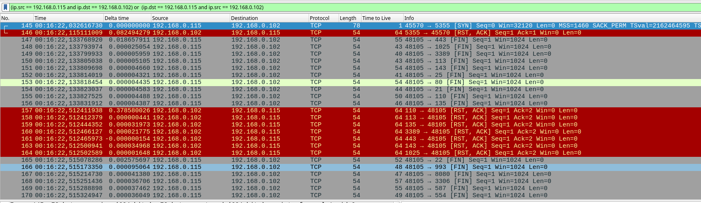

# Домашнее задание к занятию "`Уязвимости и атаки на информационные системы»`" - `Варфоломеева Марьяна`


### Задание 1

Скачайте и установите виртуальную машину Metasploitable: https://sourceforge.net/projects/metasploitable/.

Это типовая ОС для экспериментов в области информационной безопасности, с которой следует начать при анализе уязвимостей.

Просканируйте эту виртуальную машину, используя **nmap**.

Попробуйте найти уязвимости, которым подвержена эта виртуальная машина.

Сами уязвимости можно поискать на сайте https://www.exploit-db.com/.

Для этого нужно в поиске ввести название сетевой службы, обнаруженной на атакуемой машине, и выбрать подходящие по версии уязвимости.

Ответьте на следующие вопросы:

- Какие сетевые службы в ней разрешены?
- Какие уязвимости были вами обнаружены? (список со ссылками: достаточно трёх уязвимостей)
  
Для сканирования уязвимостей была запущена команда ```nmap -sV 192.168.0.102```
Список открытых служб:


Список 3 уязвимостей:
- vsftpd  - Backdoor Command Execution https://www.exploit-db.com/exploits/17491
- OpenSMTPD - OOB Read Local Privilege Escalation https://www.exploit-db.com/exploits/48185
- Apache Tomcat - AJP 'Ghostcat' File Read/Inclusion  https://www.exploit-db.com/exploits/49039


### Задание 2

Проведите сканирование Metasploitable в режимах SYN, FIN, Xmas, UDP.

Запишите сеансы сканирования в Wireshark.

Ответьте на следующие вопросы:

- Чем отличаются эти режимы сканирования с точки зрения сетевого трафика?
- Как отвечает сервер?

#### SYN-сканирование
```nmap -sS```
При SYN-сканировании клиент отправляет TCP-пакеты с установленным флагом SYN на целевые порты. Если порт открыт, сервер 
отвечает TCP-пакетом с установленными флагами SYN/ACK. 
Если порт закрыт, сервер отвечает пакетом с флагом RST.


#### FIN-сканирование
```nmap -sF``` 
При FIN-сканировании клиент отправляет TCP-пакеты с установленным флагом FIN на целевые порты. 
Если порт открыт, сервер проигнорирует сообщение. 
Если порт закрыт, сервер отвечает пакетом с флагом RST. 



#### Xmas-сканирование 
```nmap -sX``` 
Xmas-сканирование использует TCP-пакеты с установленными флагами FIN, URG и PUSH для определения открытых портов. 
Если порт открыт, сервер проигнорирует сообщение. 
Если порт закрыт, сервер ответит пакетом с флагом RST. 


#### UDP-сканирование
```nmap -sU``` 
UDP-сканирование использует UDP-пакеты для определения открытых UDP-портов на целевом хосте. 
Если порт открыт, сервер может ответить UDP-пакетом. 
Если порт закрыт, сервер обычно отвечает ICMP-пакетом "Port Unreachable". 
